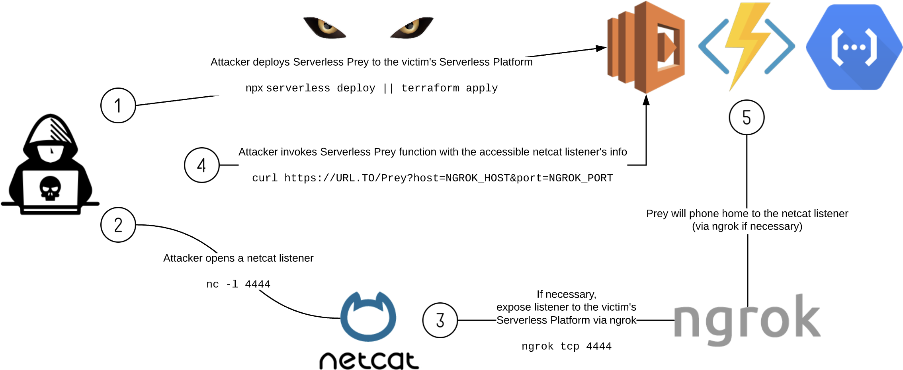

# Puma Scan Serverless Prey

Serverless Prey is a collection of serverless functions (FaaS) for [GCP Functions](cheetah), [Azure Functions](cougar), and [AWS Lambda](panther). Once launched to the environment and invoked, these functions establish a TCP reverse shell for the purposes of introspecting the container runtimes of the various function runtimes.

This repository also contains research performed using these functions, including documentation on where secrets are stored, how to extract sensitive data, and identify monitoring / incident response data points.

## Disclaimer

**Serverless Prey functions are intended for research purposes only and should not be deployed to production accounts.** By their nature, they provide shell access to your runtime environment, which can be abused by a malicious actor to exfiltrate sensitive data or gain unauthorized access to related cloud services.

## Contributors

[Eric Johnson](https://github.com/ejohn20) - Principal Security Engineer, Puma Security

[Brandon Evans](https://github.com/BrandonE) - Senior Application Security Engineer, Asurion
