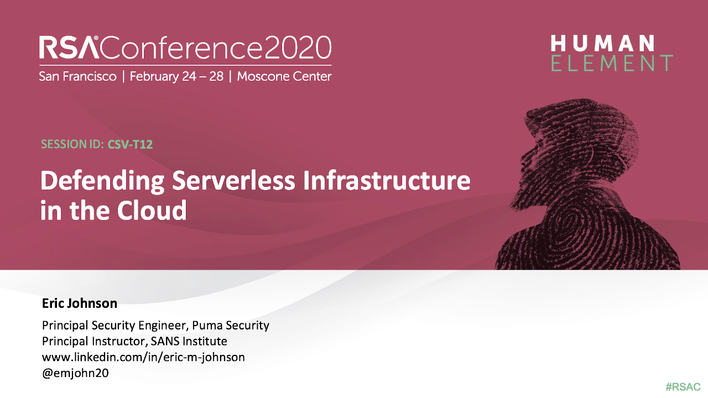
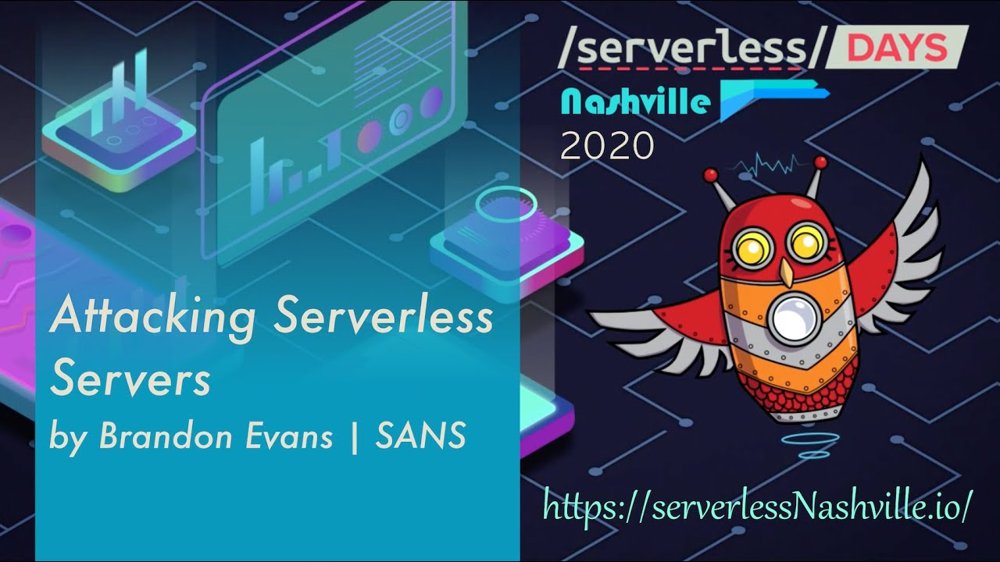

# Puma Security Serverless Prey

Serverless Prey is a collection of serverless functions (FaaS), that, once launched to a cloud environment and invoked, establish a TCP reverse shell, enabling the user to introspect the underlying container:

* [Panther](panther): AWS Lambda written in Node.js
* [Cougar](cougar): Azure Function written in C#
* [Cheetah](cheetah): Google Cloud Function written in Go

This repository also contains research performed using these functions, including documentation on where secrets are stored, how to extract sensitive data, and identify monitoring / incident response data points.

## Disclaimer

**Serverless Prey functions are intended for research purposes only and should not be deployed to production accounts.** By their nature, they provide shell access to your runtime environment, which can be abused by a malicious actor to exfiltrate sensitive data or gain unauthorized access to related cloud services.

## Contributors

[Eric Johnson](https://github.com/ejohn20) - Principal Security Engineer, Puma Security

[Brandon Evans](https://github.com/BrandonE) - Senior Application Security Engineer, Asurion

## Learning More

### Featured At

RSA Conference 2020                                                                                                                                                                     |  serverlessDays Nashville 2020
:--------------------------------------------------------------------------------------------------------------------------------------------------------------------------------------:|:---------------------------------------------------------------------------------------------------------------------------------------------------------------------:
  |  
[Video](https://www.youtube.com/watch?v=tlZ2PIXTHxc) - [Slide Deck](docs/serverlessdays-nashville-2020-attacking-serverless-servers.pdf)                                                   [Video](https://www.youtube.com/watch?v=SV69iUrYlTQ) - [Slide Deck](docs/serverlessdays-nashville-2020-attacking-serverless-servers.pdf)